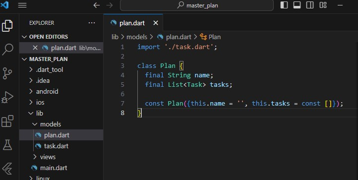
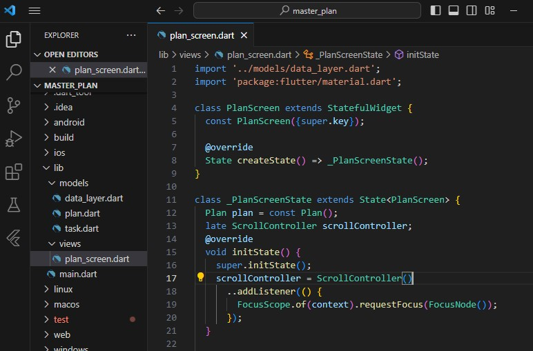
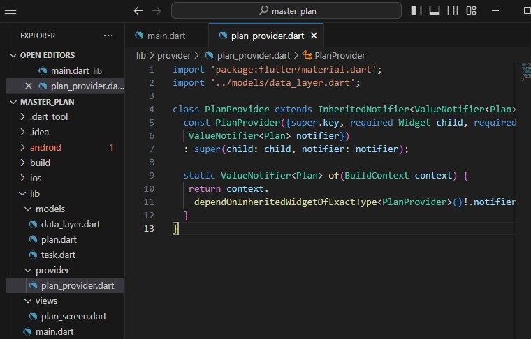
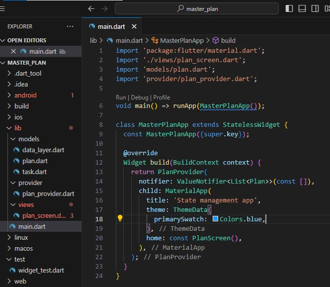

# master_plan

<b>Praktikum 1: Dasar State dengan Model-View</b>

Langkah 1: Buat Project Baru
Buatlah sebuah project flutter baru dengan nama master_plan di folder src week-11 repository GitHub Anda. Lalu buatlah susunan folder dalam project seperti gambar berikut ini.

Langkah 2: Membuat model task.dart
Praktik terbaik untuk memulai adalah pada lapisan data (data layer). Ini akan memberi Anda gambaran yang jelas tentang aplikasi Anda, tanpa masuk ke detail antarmuka pengguna Anda. Di folder model, buat file bernama task.dart dan buat class Task. Class ini memiliki atribut description dengan tipe data String dan complete dengan tipe data Boolean, serta ada konstruktor. Kelas ini akan menyimpan data tugas untuk aplikasi kita. Tambahkan kode berikut:

Langkah 3: Buat file plan.dart
Kita juga perlu sebuah List untuk menyimpan daftar rencana dalam aplikasi to-do ini. Buat file plan.dart di dalam folder models dan isi kode seperti berikut.

Langkah 4: Buat file data_layer.dart
Kita dapat membungkus beberapa data layer ke dalam sebuah file yang nanti akan mengekspor kedua model tersebut. Dengan begitu, proses impor akan lebih ringkas seiring berkembangnya aplikasi. Buat file bernama data_layer.dart di folder models. Kodenya hanya berisi export seperti berikut.

Langkah 5: Pindah ke file main.dart
Ubah isi kode main.dart sebagai berikut.

Langkah 6: buat plan_screen.dart
Pada folder views, buatlah sebuah file plan_screen.dart dan gunakan templat StatefulWidget untuk membuat class PlanScreen. Isi kodenya adalah sebagai berikut. Gantilah teks ‘Namaku' dengan nama panggilan Anda pada title AppBar.

Langkah 7: buat method _buildAddTaskButton()
Anda akan melihat beberapa error di langkah 6, karena method yang belum dibuat. Ayo kita buat mulai dari yang paling mudah yaitu tombol Tambah Rencana. Tambah kode berikut di bawah method build di dalam class _PlanScreenState.

Langkah 8: buat widget _buildList()
Kita akan buat widget berupa List yang dapat dilakukan scroll, yaitu ListView.builder. Buat widget ListView seperti kode berikut ini.

Langkah 9: buat widget _buildTaskTile
Dari langkah 8, kita butuh ListTile untuk menampilkan setiap nilai dari plan.tasks. Kita buat dinamis untuk setiap index data, sehingga membuat view menjadi lebih mudah. Tambahkan kode berikut ini.

Run atau tekan F5 untuk melihat hasil aplikasi yang Anda telah buat. Capture hasilnya untuk soal praktikum nomor 4.

Langkah 10: Tambah Scroll Controller
Anda dapat menambah tugas sebanyak-banyaknya, menandainya jika sudah beres, dan melakukan scroll jika sudah semakin banyak isinya. Namun, ada salah satu fitur tertentu di iOS perlu kita tambahkan. Ketika keyboard tampil, Anda akan kesulitan untuk mengisi yang paling bawah. Untuk mengatasi itu, Anda dapat menggunakan ScrollController untuk menghapus focus dari semua TextField selama event scroll dilakukan. Pada file plan_screen.dart, tambahkan variabel scroll controller di class State tepat setelah variabel plan.

Langkah 11: Tambah Scroll Listener
Tambahkan method initState() setelah deklarasi variabel scrollController seperti kode berikut.

Langkah 12: Tambah controller dan keyboard behavior
Tambahkan controller dan keyboard behavior pada ListView di method _buildList seperti kode berikut ini.

Langkah 13: Terakhir, tambah method dispose()
Terakhir, tambahkan method dispose() berguna ketika widget sudah tidak digunakan lagi.

Langkah 14: Hasil
Lakukan Hot restart (bukan hot reload) pada aplikasi Flutter Anda. Anda akan melihat tampilan akhir seperti gambar berikut. Jika masih terdapat error, silakan diperbaiki hingga bisa running.

<b>Tugas Praktikum 1: Dasar State dengan Model-View</b>

1. Selesaikan langkah-langkah praktikum tersebut, lalu dokumentasikan berupa GIF hasil akhir praktikum beserta penjelasannya di file README.md! Jika Anda menemukan ada yang error atau tidak berjalan dengan baik, silakan diperbaiki.

2. Jelaskan maksud dari langkah 4 pada praktikum tersebut! Mengapa dilakukan demikian?
Langkah 4 pada praktikum tersebut menginstruksikan untuk membuat file data_layer.dart yang berisi pernyataan export (export) untuk dua model, yaitu plan.dart dan task.dart. Tujuan dari langkah ini adalah:
- Pengelompokan Data Layer: Dengan membuat file data_layer.dart, kita dapat mengelompokkan beberapa data layer (model) ke dalam satu file. Ini membantu mengorganisir struktur proyek dan memudahkan identifikasi serta pengelolaan model-model yang terkait.
- Sederhana dan Ringkas dalam Impor: Dengan adanya file data_layer.dart yang mengekspor kedua model tersebut, penggunaan di bagian lain dari aplikasi dapat menjadi lebih sederhana dan ringkas. Sebagai contoh, jika suatu bagian dari aplikasi perlu mengakses baik Plan maupun Task, cukup mengimpor satu file (data_layer.dart) daripada dua file terpisah.
- Peningkatan Skalabilitas: Praktikum tersebut mencatat bahwa dengan pendekatan ini, "proses impor akan lebih ringkas seiring berkembangnya aplikasi." Artinya, jika aplikasi berkembang dan lebih banyak model atau data layer ditambahkan, pendekatan ini akan membantu menjaga kejelasan dan keterbacaan kode.
- Mudah Dikelola dan Diorganisir: Struktur proyek yang baik membantu dalam pemeliharaan kode. Dengan memisahkan lapisan data ke dalam satu file yang diimpor, kita dapat dengan mudah memahami dan memelihara model-model tersebut. Ini juga dapat mempermudah pengerjaan bersama dengan tim pengembang.

3. Mengapa perlu variabel plan di langkah 6 pada praktikum tersebut? Mengapa dibuat konstanta ?
Variabel plan yang dideklarasikan pada langkah 6 di praktikum tersebut berfungsi sebagai bagian dari state (_state) dari widget PlanScreen. Penjelasan mengapa variabel ini diperlukan dan dibuat konstan adalah sebagai berikut:
- Mengelola State: Flutter menggunakan konsep stateful widget untuk mengelola perubahan dalam suatu layar atau tampilan. Variabel plan di sini adalah bagian dari state (_state) dari widget PlanScreen. Saat terjadi perubahan pada state, metode build akan dipanggil kembali untuk membangun kembali UI sesuai dengan state terbaru.
- Inisialisasi Awal: Dengan menginisialisasi plan pada saat pembuatan state (_PlanScreenState), kita dapat memberikan nilai awal atau default ke dalam state. Ini memberikan nilai awal untuk menampilkan informasi atau data pada layar saat pertama kali layar itu dibuat.
- Penggunaan Konstanta: Dengan menandai plan sebagai konstan (const Plan()), kita memberikan indikasi bahwa objek ini tidak akan berubah selama siklus hidup state. Ini dapat meningkatkan efisiensi dan membantu dalam mengoptimalkan performa aplikasi.

Berikut adalah beberapa poin terkait keputusan untuk membuat plan sebagai konstan:
- Plan() merupakan inisialisasi objek dari kelas Plan. Dalam konteks ini, kita mungkin ingin menggunakan nilai default atau objek yang sama setiap kali state diinisialisasi ulang.
- Menandai plan sebagai konstan dapat membantu dalam mendeteksi kesalahan atau perubahan yang tidak diinginkan pada saat kompilasi.
- Jika Plan memiliki konstruktor yang mengharuskan parameter, kita mungkin perlu menyesuaikan cara objek tersebut diinisialisasi. Dalam kasus praktikum ini, konstruktor Plan diisi dengan parameter default sehingga dapat diinisialisasi tanpa memerlukan parameter tambahan.

4. Lakukan capture hasil dari Langkah 9 berupa GIF, kemudian jelaskan apa yang telah Anda buat!
Fungsi _buildTaskTile yang telah dibuat memiliki tujuan untuk membangun widget ListTile dinamis untuk menampilkan dan mengedit setiap nilai dari daftar plan.tasks. Berikut adalah penjelasan mengenai apa yang telah dibuat dalam fungsi tersebut:
- Checkbox: Widget Checkbox digunakan sebagai bagian leading dari ListTile untuk menampilkan dan mengelola status keberlanjutan dari tugas (task). Checkbox ini memiliki nilai (value) yang diambil dari atribut complete dari objek Task. Saat nilai Checkbox berubah, fungsi onChanged akan dipanggil.
- TextField: Widget TextFormField digunakan sebagai bagian title dari ListTile untuk menampilkan dan mengedit deskripsi dari tugas. Nilai awal (initialValue) dari TextField diatur sebagai deskripsi yang ada dalam objek Task. Ketika nilai TextField berubah, fungsi onChanged akan dipanggil.
- setState(): Setiap kali terjadi perubahan pada Checkbox atau TextField, fungsi setState dipanggil. Ini memastikan bahwa tampilan UI diperbarui sesuai dengan perubahan yang dilakukan pada state plan.
- Pembaruan Data: Dalam setiap pembaruan, objek plan diupdate dengan nilai yang baru. Untuk memastikan bahwa perubahan tersebut dapat diterapkan, kita membuat objek Plan baru dengan mengganti nilai tugas (tasks) yang sesuai pada indeks tertentu. Ini memastikan bahwa state tetap imutabel, yang sesuai dengan paradigma Flutter untuk mengelola state.

5. Apa kegunaan method pada Langkah 11 dan 13 dalam lifecyle state ?
Langkah 11: Tambah Scroll Listener (initState)
Tujuan utama dari menambahkan scroll listener adalah untuk memberikan interaktivitas yang lebih baik pada widget yang digunakan. Pada contoh ini, ketika pengguna melakukan scrolling, ingin menghilangkan fokus dari input fields atau form yang sedang aktif, sehingga keyboard akan ditutup. Hal ini dapat meningkatkan pengalaman pengguna (user experience) dan membuat aplikasi terasa lebih responsif.

Langkah 13: Terakhir, tambah method dispose()
Tujuan dari menggunakan dispose adalah untuk mencegah memory leaks dan mengoptimalkan penggunaan sumber daya. Pembersihan sumber daya seperti ini sangat penting terutama ketika menggunakan controller atau objek lain yang memerlukan penanganan khusus saat widget dihapus dari pohon widget.

6. Kumpulkan laporan praktikum Anda berupa link commit atau repository GitHub ke spreadsheet yang telah disediakan!

<b>Praktikum 2: Mengelola Data Layer dengan InheritedWidget dan InheritedNotifier</b>

Langkah 1: Buat file plan_provider.dart
Buat folder baru provider di dalam folder lib, lalu buat file baru dengan nama plan_provider.dart berisi kode seperti berikut.

Langkah 2: Edit main.dart
Gantilah pada bagian atribut home dengan PlanProvider seperti berikut. Jangan lupa sesuaikan bagian impor jika dibutuhkan.

Langkah 3: Tambah method pada model plan.dart
Tambahkan dua method di dalam model class Plan seperti kode berikut.

Langkah 4: Pindah ke PlanScreen
Edit PlanScreen agar menggunakan data dari PlanProvider. Hapus deklarasi variabel plan (ini akan membuat error). Kita akan perbaiki pada langkah 5 berikut ini.

Langkah 5: Edit method _buildAddTaskButton
Tambahkan BuildContext sebagai parameter dan gunakan PlanProvider sebagai sumber datanya. Edit bagian kode seperti berikut.

Langkah 6: Edit method _buildTaskTile
Tambahkan parameter BuildContext, gunakan PlanProvider sebagai sumber data. Ganti TextField menjadi TextFormField untuk membuat inisial data provider menjadi lebih mudah.

Langkah 7: Edit _buildList
Sesuaikan parameter pada bagian _buildTaskTile seperti kode berikut.

Langkah 8: Tetap di class PlanScreen
Edit method build sehingga bisa tampil progress pada bagian bawah (footer). Caranya, bungkus (wrap) _buildList dengan widget Expanded dan masukkan ke dalam widget Column seperti kode pada Langkah 9.

Langkah 9: Tambah widget SafeArea
Terakhir, tambahkan widget SafeArea dengan berisi completenessMessage pada akhir widget Column. Perhatikan kode berikut ini.

Akhirnya, run atau tekan F5 jika aplikasi belum running. Tidak akan terlihat perubahan pada UI, namun dengan melakukan langkah-langkah di atas, Anda telah menerapkan cara memisahkan dengan baik antara view dan model. Ini merupakan hal terpenting dalam mengelola state di aplikasi Anda.

<b>Tugas Praktikum 2: InheritedWidget</b>

1. Selesaikan langkah-langkah praktikum tersebut, lalu dokumentasikan berupa GIF hasil akhir praktikum beserta penjelasannya di file README.md! Jika Anda menemukan ada yang error atau tidak berjalan dengan baik, silakan diperbaiki sesuai dengan tujuan aplikasi tersebut dibuat.

2. Jelaskan mana yang dimaksud InheritedWidget pada langkah 1 tersebut! Mengapa yang digunakan InheritedNotifier?

InheritedWidget pada Langkah 1:
Pada langkah 1, membuat sebuah subclass dari InheritedNotifier yang disebut PlanProvider. InheritedWidget adalah sebuah widget khusus di Flutter yang memungkinkan data atau state dibagikan melintasi pohon widget kepada anak-anaknya. Saat data atau state berubah, InheritedWidget akan memberi tahu anak-anaknya untuk melakukan pembaharuan.

PlanProvider di sini adalah suatu bentuk spesifik dari InheritedWidget yang menggunakan InheritedNotifier. InheritedNotifier adalah subclass dari InheritedWidget yang terkait dengan ValueNotifier. ValueNotifier adalah objek yang dapat dipantau (observable) dan memberi tahu pendengarnya saat nilainya berubah. Dengan menggabungkan keduanya, kita mendapatkan mekanisme untuk menyebarkan perubahan pada objek ValueNotifier<Plan> ke seluruh cabang widget di bawahnya.

Mengapa Menggunakan InheritedNotifier:
- Reaktivitas: InheritedNotifier memberikan reaktivitas terhadap perubahan pada nilai ValueNotifier<Plan>. Ketika ValueNotifier ini mengalami perubahan, semua widget yang tergantung padanya akan diberi tahu dan diperbarui.
- Pemisahan Data dari UI: Dengan menggunakan InheritedNotifier, dapat memisahkan logika data (ValueNotifier<Plan>) dari UI. Ini merupakan prinsip desain yang baik yang membantu dalam menjaga pemisahan tugas dan meningkatkan kemudahan pemeliharaan.
- Dependency Lookup: Method of pada PlanProvider digunakan untuk mendapatkan nilai ValueNotifier<Plan> dari pohon widget. Ini memberikan cara yang efisien untuk mendapatkan data di bawah widget tertentu tanpa perlu melewati properti dari satu widget ke widget lain secara eksplisit.

3. Jelaskan maksud dari method di langkah 3 pada praktikum tersebut! Mengapa dilakukan demikian?
Dua method yang ditambahkan pada langkah 3 memiliki tujuan untuk memberikan informasi terkait dengan kelengkapan (completeness) dari suatu Plan. Berikut adalah penjelasan maksud dari masing-masing method:

int get completedCount:
Maksud: Method ini mengembalikan jumlah tugas (tasks) yang sudah selesai (complete) dalam suatu Plan.
Alasan: Dengan memiliki informasi jumlah tugas yang sudah selesai, kita dapat dengan mudah menghitung kemajuan (progress) suatu Plan. Informasi ini dapat digunakan untuk menampilkan jumlah tugas yang sudah selesai di antarmuka pengguna (UI) atau untuk keperluan logika bisnis tertentu.

String get completenessMessage:
Maksud: Method ini mengembalikan pesan yang menyatakan seberapa lengkap (completedCount) suatu Plan dari total jumlah tugas yang ada.
Alasan: Dengan menyediakan pesan yang menyatakan kelengkapan suatu Plan, kita dapat menggunakan informasi ini untuk memberikan umpan balik kepada pengguna atau untuk tujuan lainnya. Pesan ini dapat mencakup informasi seperti "2 out of 5 tasks completed," yang dapat membantu pengguna memahami kemajuan suatu Plan dengan cepat.

4. Lakukan capture hasil dari Langkah 9 berupa GIF, kemudian jelaskan apa yang telah Anda buat!
Pada langkah 9, beberapa perubahan telah dilakukan di dalam class PlanScreen:
- Penambahan Widget SafeArea:
Dalam widget Column, di bagian paling bawah, ditambahkan widget SafeArea yang berisi widget Text dengan teks plan.completenessMessage.
SafeArea digunakan untuk memastikan bahwa pesan kelengkapan (completenessMessage) tidak tersembunyi atau terpotong oleh elemen-elemen di sekitar layar, seperti notch atau tepi layar.
- Penggunaan ValueListenableBuilder:
Sebagai bagian dari widget body, digunakan ValueListenableBuilder yang mendengarkan perubahan pada ValueNotifier<Plan>. Ini memastikan bahwa tampilan layar akan diperbarui secara otomatis setiap kali Plan berubah.
Widget ValueListenableBuilder memungkinkan kita untuk merespons perubahan pada Plan dan membangun tampilan UI sesuai dengan nilai baru.
- Perubahan Parameter _buildList:
Saat memanggil _buildList(plan), kita memberikan nilai plan ke dalam method ini. Sebagai hasilnya, _buildList sekarang dapat menggunakan nilai plan tersebut untuk membangun daftar tugas.

5. Kumpulkan laporan praktikum Anda berupa link commit atau repository GitHub ke spreadsheet yang telah disediakan!

<b>Praktikum 3: Membuat State di Multiple Screens</b>

Langkah 1: Edit PlanProvider
Perhatikan kode berikut, edit class PlanProvider sehingga dapat menangani List Plan.

Langkah 2: Edit main.dart
Langkah sebelumnya dapat menyebabkan error pada main.dart dan plan_screen.dart. Pada method build, gantilah menjadi kode seperti ini.

Langkah 3: Edit plan_screen.dart
Tambahkan variabel plan dan atribut pada constructor-nya seperti berikut.

Langkah 4: Error
Itu akan terjadi error setiap kali memanggil PlanProvider.of(context). Itu terjadi karena screen saat ini hanya menerima tugas-tugas untuk satu kelompok Plan, tapi sekarang PlanProvider menjadi list dari objek plan tersebut.

Langkah 5: Tambah getter Plan
Tambahkan getter pada _PlanScreenState seperti kode berikut.

Langkah 6: Method initState()
Pada bagian ini kode tetap seperti berikut.

Langkah 7: Widget build
Pastikan Anda telah merubah ke List dan mengubah nilai pada currentPlan seperti kode berikut ini.

Langkah 8: Edit _buildTaskTile
Pastikan ubah ke List dan variabel planNotifier seperti kode berikut ini.

Langkah 9: Buat screen baru
Pada folder view, buatlah file baru dengan nama plan_creator_screen.dart dan deklarasikan dengan StatefulWidget bernama PlanCreatorScreen. Gantilah di main.dart pada atribut home menjadi seperti berikut.

Langkah 10: Pindah ke class _PlanCreatorScreenState
Kita perlu tambahkan variabel TextEditingController sehingga bisa membuat TextField sederhana untuk menambah Plan baru. Jangan lupa tambahkan dispose ketika widget unmounted seperti kode berikut.

Langkah 11: Pindah ke method build
Letakkan method Widget build berikut di atas void dispose. Gantilah ‘Namaku' dengan nama panggilan Anda.

Langkah 12: Buat widget _buildListCreator
Buatlah widget berikut setelah widget build.

Langkah 13: Buat void addPlan()
Tambahkan method berikut untuk menerima inputan dari user berupa text plan.

Langkah 14: Buat widget _buildMasterPlans()
Tambahkan widget seperti kode berikut.

Terakhir, run atau tekan F5 untuk melihat hasilnya jika memang belum running. Bisa juga lakukan hot restart jika aplikasi sudah running. Maka hasilnya akan seperti gambar berikut ini.

<b>Tugas Praktikum 3: State di Multiple Screens</b>

1. Selesaikan langkah-langkah praktikum tersebut, lalu dokumentasikan berupa GIF hasil akhir praktikum beserta penjelasannya di file README.md! Jika Anda menemukan ada yang error atau tidak berjalan dengan baik, silakan diperbaiki sesuai dengan tujuan aplikasi tersebut dibuat.

2. Berdasarkan Praktikum 3 yang telah Anda lakukan, jelaskan maksud dari gambar diagram berikut ini!

3. Lakukan capture hasil dari Langkah 14 berupa GIF, kemudian jelaskan apa yang telah Anda buat!
Pada langkah 14, sebuah widget baru bernama _buildMasterPlans() telah ditambahkan. Berikut penjelasan mengenai fungsi dan tujuan dari widget ini:
- _buildMasterPlans() Widget:
    - Widget ini bertanggung jawab untuk membangun tampilan yang menampilkan daftar rencana (plans).
    - Daftar rencana diambil dari planNotifier.value, yang merupakan nilai dari ValueNotifier<List<Plan>> yang didapatkan dari PlanProvider.
    - Jika daftar rencana kosong, maka widget akan menampilkan pesan informasi bahwa pengguna belum memiliki rencana apapun, beserta ikon dan gaya teks yang sesuai.
- Jika Daftar Rencana Tidak Kosong:
    - Jika terdapat rencana dalam daftar, widget akan menggunakan ListView.builder untuk membuat daftar tugas yang dapat di-scroll.
    - Setiap elemen dalam daftar direpresentasikan oleh widget ListTile yang menampilkan nama rencana (plan.name) sebagai judul dan informasi kelengkapan (plan.completenessMessage) sebagai subjudul.
    - Saat pengguna mengetuk salah satu rencana, aplikasi akan membuka PlanScreen untuk rencana yang dipilih.
- Navigasi ke PlanScreen:
    - Saat ListTile ditekan, aplikasi melakukan navigasi ke PlanScreen dengan menggunakan Navigator.of(context).push(...).
    - PlanScreen ditampilkan dengan menggunakan rute (MaterialPageRoute) dan mengirimkan rencana yang dipilih sebagai parameter.

4. Kumpulkan laporan praktikum Anda berupa link commit atau repository GitHub ke spreadsheet yang telah disediakan!
